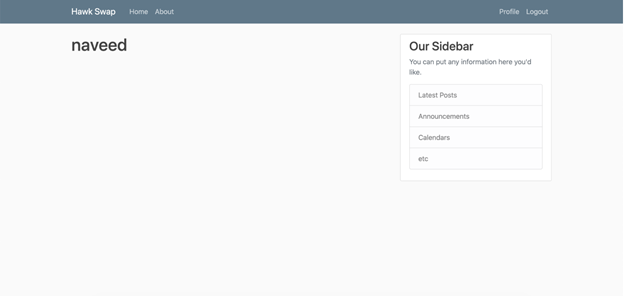
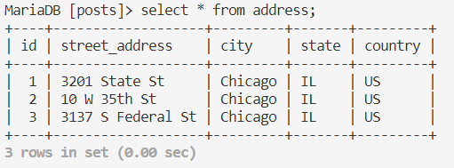
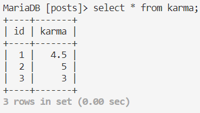
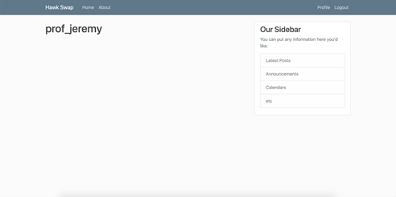
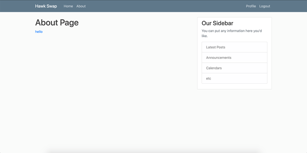

# Sprint-03 Written Report

## Team Number 06
* **Rida Tariq** - Project Manager
* **Cristian Pintor** - Developer
* **Hareem Akram** - Jr. Developer
* **Muhammad Naveed Zahid** - UI/UX
* **Grace Kwon** - IT Operations

### UI/UX Artifacts

In this sprint we did make some changes from and we kind of started from scratch again as the things we decided in the last sprint were not able to work together easily. Definitely I would say that all of our team members went out of their way and helped each other but especially Cristian he did a great job to make sure everything is running smoothly. I was a UI/UX for this sprint and our page will be looking different then we had it in the diagrams as we are using a different language.. It’s just the design that will be different but the stuff is still the same. We have a register page and also the login page. They both are working and connected without any problems. 

The user story as a person who hasn’t seen the site before. When you land on the first page you will have a good color scheme. You have some tabs on the left side like home and about. On the right side we have a login and register button. You can go to the login page and if you don’t have an account you can just click the link below and it will take you to the registration page which is the same if you just register. After you login you are taken to your profile page you can update if needed. From there you can also post and delete a post if needed. This is what we have so far as this sprint required it. Moving forward we are planning on adding the comments section on the post so the user can communicate with each other regarding those posts. 

As mentioned earlier the things the site is doing is similar to the diagrams but the design is different. 

Log In Page:


Register page:


Product listing page: 


User profile:



### Infrastructure

Using Packer and Vagrant you will begin to break your monolithic application up into at least 2 servers (frontend and backend)

*	Using the host only network declared via Vagrant
    * 192.168.33 for frontend


**Vagrantfile for frontend**


    *  192.168.33.34 for datastore/database


**Vagrantfile for backend (database)**

*	Store your scripts in a code folder on your repo
*	Update the install.md template file with build and install instructions
  *	This will include automated provisioning of all assumptions and secrets defined in the first sprint (firewall rules, admin accounts, user accounts, secrets/passwords, etc, etc

**You can find detailed installation instructions from this link:**
https://github.com/illinoistech-itm/2021-team06r/blob/main/sprint-03/install.md

*	This will also require automated deployment of the ERD you created for your database and installation of the database product you chose. All of these steps will be automated.

 

**I updated create-table.sql as well as the according files so that the tables shown above are created - customer, address, karma, chat, chat_conversations. Some of them have been populated like this:**

 

 

 

**This matches our previous ERD:**


The one missing table - product - was worked on by Cristian and it looks like this:

 

### Developer

Working user registration page and process

When the user first goes into the site, they will be able to pick between the Login or Register buttons, if the user does not have an account, then the user can create an account through the Registration page. 

User registration page:


After the user has registered, they will see a registration message:


After registration, user can login back in and is first welcomed to the main page:


If the user clicks the Profile link, they can view their profile:


**Working user login (at least 3 accounts demonstrated)**

These are 3 current user accounts:


Here are the profiles for each user listed above:





One of them is an admin user, cpintor, and the rest are front-end users. The admin user can add new users in the backend, delete posts or create new ones. Unfortunately, we did not complete the functionality for front-end users to create posts, but we are currently working on it and should have it working by next sprint!

**Create and identify to us at least 3 additional pages/functionalities**
We currently have an About Page, which should inform the users about our website, we plan to add more pages as well. 



### Junior Developer

For this sprint, the Junior Developer was responsible for two major things: tightening security so only the frontend could connect to the backend, and working with IT Operations and the Developer to create three user accounts that had two posts each in the database.

In order to increase security, the first task that needed to be done was to deny connections to the backend from every IP address but the frontend. We did this by running an uncomplicated firewall (ufw) allow command that would only let the frontend connect to the backend and deny all other connections. In order to further enhance security, the IP address was passed through as a variable, with the actual IP only being found in a variables.json file that remains local and is never pushed to the remote.

To demonstrate that user accounts can be created and used in the application, we hard coded some test accounts into our build scripts with sample data that will populate the appropriate columns when the machine is built and run. Some of these values are dynamic (such as the karma rating of each user), and will be updated as needed once the application is up and running, and in use by those users and more.

### Project Manager

1. Place images of the full User & Admin and/or anonymous story here with annotations of the functioning and the non-functioning portions as necessary (can reuse the artifact created by UI/UX)
1. Include a file  ```install.md``` in the root of the team GitHub Repo detailing all instructions to build and run the functioning parts of your site
1. Verify that all defined minimum goals were met and explain goals that were reached beyond what was defined.  Also explain reasons behind goals that were not met.
1. List any detailed assumptions your team made explaining deliverable context as needed

# Sprint-01 Report


## UI/UX Report
* **Website**
  * Both mobile and desktop friendly
* **Similar websites**
  * https://www.daangn.com/
  * https://www.olx.com.pk/
* **How do similar websites work?**
  * Parallel system for customers running side by side
    * Sellers can upload their advertisements
      * Included: title, description, picture, price
    * Buyers can browse through the listing
      * Browse through several alternatives
      * Contact & negotiate with the seller, then purchase
  * Interesting fact about OLX
    * Conversation, bargaining, advances, and transactions remain between the buyer and seller only
  * C2C (Consumer-to-Consumer) business model

## Developer Report
* **Frontend: HTML, CSS, React.js**
  * HTML & CSS
    * Major players in the overall web design of the final product
  * JavaScript
    * Improves the user experience by taking a static webpage and turning it into a dynamic, interactive one
    * Offers much more in terms of programming beyond aesthetics and ease of use
* **Backend: Python**
  * High efficiency, stability, and scope of development
  * Great readability: blocks of code can be “inherited” (reused) throughout the program – both reducing clutter and the chances of error
    * Inheritance + Python’s relatively simple syntax => faster development
* **Web Framework: Django**
  * Extensive libraries and functions that well-equip Python
  * Used at Instagram and Spotify
    * Instagram: primarily for photo management
    * Spotify: overall backend development & data analytics
  * Integrate well with our website's frontend technology
  * Fully capable of being used in the backend development of a website
    * Any features not present in the backend can be added in the frontend and still work seamlessly
  * Extensive frameworks that improve the development experience
    * <b>Our choice: React.js</b>
      * Renders web pages quickly; elements and content are being loaded without a large delay
        * Improves user experience
        * Allows constant update of any dynamic elements that may be present on the website
      * Created by Facebook
        * Now used by Reddit, Notion.so and even Netflix
  
## IT Infrastructure Report
* **OS: Ubuntu**
  * Compatible with database like MYSQL
  * Open source OS; we can use it with other services as well
* **Database: MySQL**
  * Usage
    * Store customer information and log in information
    * Save data that customers upload
* **Caching layer: X**
  * There won't be a lot of traffic, so it's not needed.
* **Additional features: Chat**
  * Users can communicate with each other.

## Developer and Security Assumptions
* **Security Vulnerabilities**
  * Cross site scripting (XSS): XSS is a vulnerability that allows malicious injections through client-side scripts into a webpage to access data
  * SQL injections: SQL injections that target vulnerabilities in databases in order to gain access, modify, or create new user permissions, or manipulate or destroy data
  * Denial-of-Service (DoS) attacks: attackers overload a server or its surrounding infrastructure with different types of attack traffic to the point where the website becomes sluggish and denies new service requests from real users
  * Data breach
* **Protecting Our Web Application and Data**
  * HTTPS & Encryption
    * With HTTPS, data is transferred between a web browser and website
    * HTTPS encrypts data using the Transport Layer Security (TLS) protocol
    * Encryption occurs through the asymmetric public key infrastructure which uses a private and public key to encrypt and decrypt data
  * How does this apply to our website?
    * Use HTTPS to protect the transfer of data in our web application
      * Prevents website information from being viewed by attackers
      * Encrypts data traffic; any text package is illegible with random characters
    * Self-signed SSL certificate instead of TLS/SSL certificates
      * Implements encryption
      * Useful for projects not in production
      * Open SSL
* **Authentication**
  * Process that allows users to verify their identity to gain access to their accounts
  * Recommendations
    * Encourage users to create strong passwords
    * Multi-factor authentication - requires a user to input a one-time access code sent via email or text
    * Limit password attempts and rests by locking a user out of their account after a certain amount of failed login attempts
      * Prevents any brute force attempts at hacking an account
* **Web Application Firewall (WAF)**
  * Protects a web app against malicious HTTP and HTTPS traffic
  * Protects against vulnerabilities such as cross-site forgery, file inclusion, cross-site scripting, and SQL injection attacks
  * Open source WAF
    * ex) ModSecurity
  * Disadvantages
    * Only detects known vulnerabilities
    * Not able to fix them
      * Instead, it hides the vulnerabilities from the hacker by blocking the malicious requests
* **Web Vulnerability Scanner**
  * Scans websites to identify vulnerabilities and any security issues
    * Cross-site scripting, SQL injections, command injections, etc.
* **When to begin working on security?**
  * Make sure that in every phase of our application development our security goals are met
  * The earlier, the better
  
## User/Admin/Anonymous Story Goes here
### Website Map


### UI/UX Prototypes
#### 1. Home


* Logo & website name on the top
* Brief introduction about the website
* Ability to navigate to other pages
* Ability to search for items
* Copyrights on the bottom

#### 2. About Us


* Our mission
* Team members

#### 3. Login / Sign Up


* Sign Up
  * Basic info
  * Username & Password
* Login
  * Username & Password

#### 4. Customer Account


* Ability to view personal information
* Ability to change

#### 5. Sell Now


* Product info
  * Title, description, (#tag), category, brand, condition, (color), price
  * Picture

#### 6. Custom Product Request


* Personal info
  * Name, email, message
* Item description
  * Product type, date needed, (color, price range)

#### 7. Item Product Listings


* Shows all the items on the website
  * Image, title, and description
* Ability to choose category
* Ability to find item by searching

#### 8. Item Product Info


* Displays what was written on the "sell now" page
* Ability to view seller
  * Able to ask seller questions with chat or comments
  * Able to make offer
* Able to save and share

## Project Manager Report
### Goals for Sprint 1
#### _Week 1 (02/04 ~ 02/10): Research and decide project idea_
  * Research the 7 given options & other ideas
  * Decide project idea and requirements
  * Get everything set up (Slack, Trello, Github, etc.)
#### _Week 2 (02/11 ~ 02/17): Research project specific needs_
  * Developer: Research frontend & backend languages and web frameworks
  * Jr. Developer: Research connection (https etc.), login authentication, and data encryption
  * IT Operations: OS, database, caching later, chats & comments
  * UI/UX: Website map, prototype
  * Project Manager: Assist chat, updates, etc.
#### _Week 3 (02/18 ~ 02/25): Further research on project needs & Deliverables_
  * Further research
  * Deliverables

***All of these goals were accomplished in a timely manner.***

### Goals for Sprint 2
1. Set up Ubuntu
2. Start making the website - backend & frontend
3. Set up database
4. Start implementing security
5. Minor bug fixes

### References
* https://searchsecurity.techtarget.com/tip/How-to-encrypt-and-secure-a-website-using-HTTPS
* https://support.google.com/domains/answer/7630973?hl=en
* https://www.creativebloq.com/web-design/website-security-tips-protect-your-site-7122853
* https://www.hostgator.com/blog/3-easy-steps-that-protect-your-website-from-hackers/
* https://swoopnow.com/website-authentication/
* https://stackoverflow.com/questions/549/the-definitive-guide-to-form-based-website-authentication
* https://beaglesecurity.com/blog/article/how-to-store-and-secure-sensitive-data-in-web-applications.html
* https://www.cloudflare.com/learning/security/what-is-web-application-security/